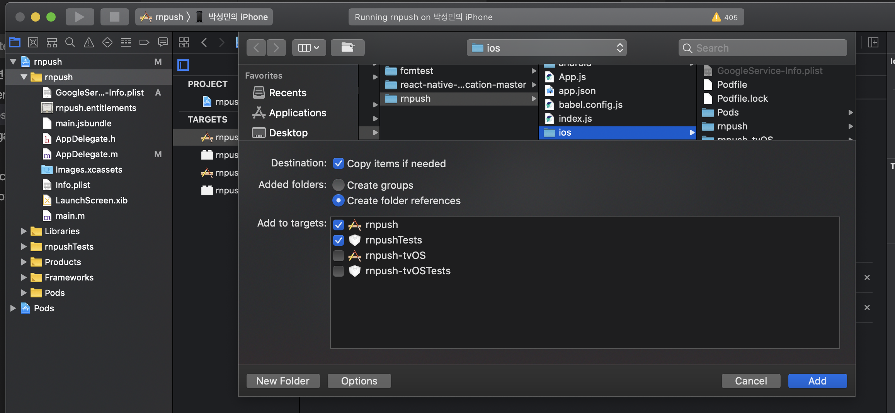
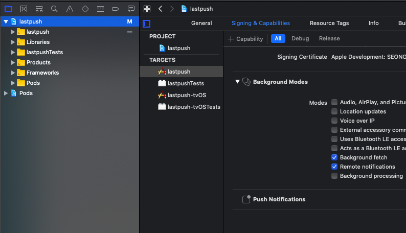
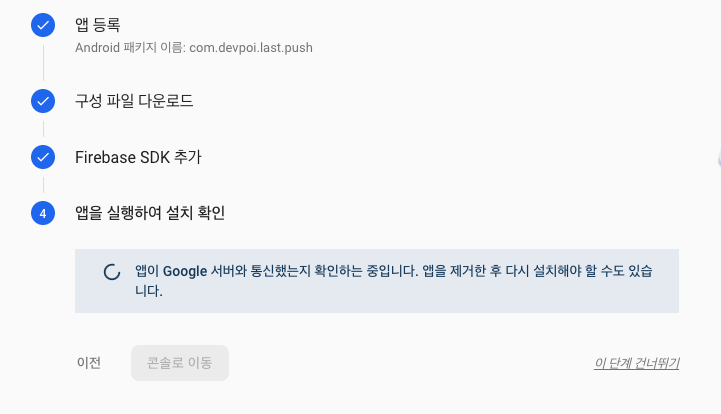
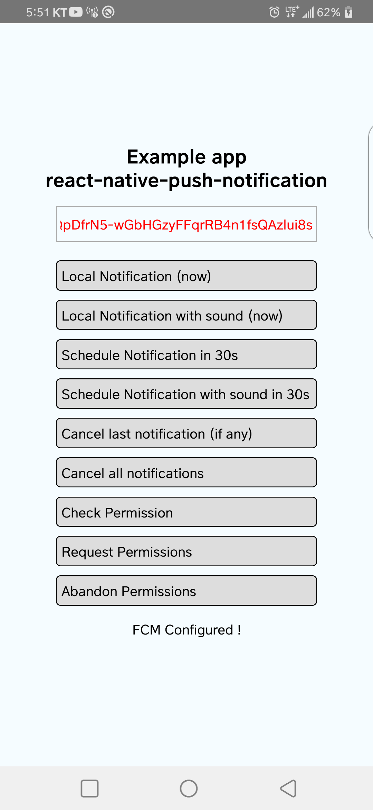
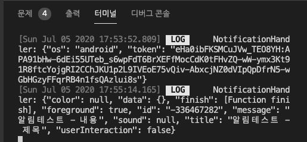
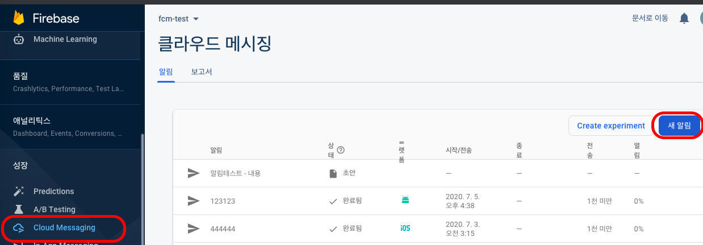
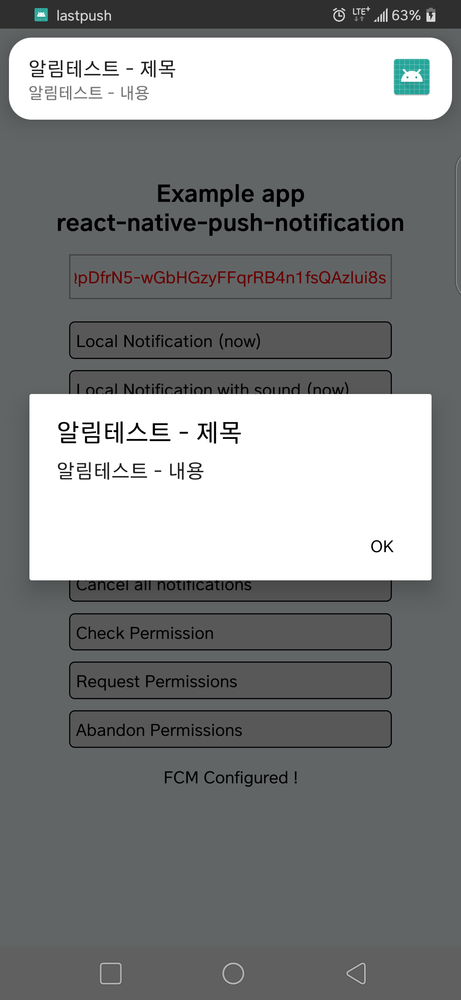
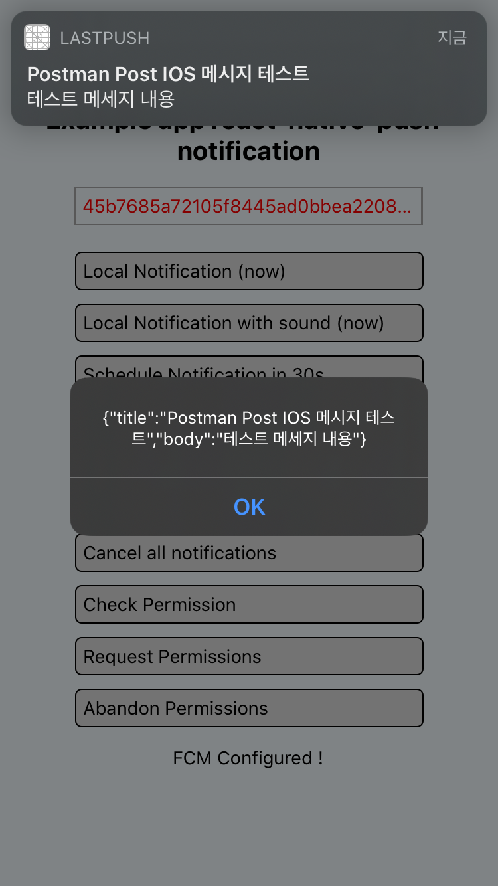

# 리액트 네이티브 푸시 알람 라이브러리 스터디

## react-native-push-notification 사용방법

파이어베이스 생성 및 연동

Android, Ios 플랫폼 모두에서 작동하는

완벽한 가이드 - 2020.07.05 Android & IOS 기준 정상 작동 확인(Local, remote)

---


# react-native-push-notification 설치 및 환경 설정 방법

> 공식 라이브러리 주소
[https://github.com/zo0r/react-native-push-notification](https://github.com/zo0r/react-native-push-notification)

> 설치 후 Test sample code 참고
[https://github.com/zo0r/react-native-push-notification/tree/master/example](https://github.com/zo0r/react-native-push-notification/tree/master/example)

> 자세한 코드 및 설치 과정은 github 주소 참고
[https://github.com/smboy86/dev-react-native-lastpush](https://github.com/smboy86/dev-react-native-lastpush)
[https://github.com/smboy86/dev-react-native-lastpush/commits/master](https://github.com/smboy86/dev-react-native-lastpush/commits/master)

> 시작전 알아야할 내용
1. FCM에 대한 개념
2. IOS 테스트를 위해서는 개발자 계정 등록이 필요함
3. IOS는 리얼디바이스에서만 테스트 가능 (테스트용기기일시 인터넷 사용이 가능 필수)

# 1. React-native 프로젝트 생성 및 설정

## 1.1 프로젝트 생성

```jsx
$ react-native init lastpush (원하는 이름으로)
$ cd lastpush
$ code . (코드 편집기 열어두기 vscode)

// (vscode 편집기 내에서 터미널 열기 - 편의성 up)
$ yarn start
$ yarn android or ( yarn ios ) 

// 실행 확인 - 이상없이 실행이 되어야 함
```

## 1.2 프로젝트 번들 아이디 설정

example) com.devpoi.last.push

[2-1) RN 패키지 명 바꾸기 pakage rename (IOS, Android)](메뉴얼 작성중) 

# 2. 파이어베이스

## 2.1 파이어베이스 프로젝트 생성 (기존 플젝 사용가능)

## 2.2 파이어베이스 프로젝트내 App 생성 (IOS, Android)

### 2.2.1 공통

1. 번들 아이디 설정 (프로젝트와 동일해야함) - ex) com.devpoi.last.push
2. 파이어베이스 구성파일 다운로드 (google-service.json / GoogleService-info.plist.plist)

### 2.2.2 Android

1. 다운받은 구성파일 프로젝트로 단순 복사
    - ~android/app/google-service.json  (폴더 경로 중요)

### 2.2.3 IOS

1. 프로젝트 파일  Add 를 통한 파일 복사

    

2. 프로젝트 Capabilities 추가
    - Background Modes 추가 >> 2 check
    - Push Notifications 추가

    

### 2.2.4 공통

1. 스크린샷과 같은 상태로 대기 or 무시하고 이 단계 건너뛰기 해도 프로젝트 구성에는 문제가 없음

    

### 2.2.5 IOS - 프로젝트 생성 이후 APNs 키 등록 (.p8 파일)

1. 애플 개발자 센터에서 Key 생성
    - [https://developer.apple.com/account/resources/authkeys/list](https://developer.apple.com/account/resources/authkeys/list)
2. 생성한 key 다운로드 (1회만 가능 잘 간직하자)
3. 해당파일 파이어베이스에 등록 (생성한 IOS 앱 설정 > 클라우드 메시징 > APN 인증 키)
    - .p8 파일 업로드
    - Key 이름 입력
    - Apple Team ID 입력

# 3. 라이브러리 설치

## 3.1 공통

### 3.1.1 라이브러리 설치

```bash
// 위 라이브러리는 설치하지 않고 설치 가이드만 따라했다. (확인중)
~~~~$ yarn add react-native-push-notification

// for IOS
$ yarn add @react-native-community/push-notification-ios
```

### 3.1.2 소스 수정

- ~App.js (수정 or 전체 대치)

- ~NotifService.js (신규)

- ~NotificationsHandler.js (신규)


## 3.2 IOS

- Podfile (수정 - 1 add)

    ```bash
      ... 
      
      pod 'Folly', :podspec => '../node_modules/react-native/third-party-podspecs/Folly.podspec'

      pod 'RNCPushNotificationIOS', :path => '../node_modules/@react-native-community/push-notification-ios' << 1) add

      target 'rnpushTests' do
        inherit! :complete
        # Pods for testing
      end
      
      ...
    ```

- AppDelegate.h (수정 - 2 add)

    ```bash
    ...
    
    #import <UserNotifications/UNUserNotificationCenter.h>  << add
    
    // UNUserNotificationCenterDelegate add
    @interface AppDelegate : UIResponder <UIApplicationDelegate, RCTBridgeDelegate, UNUserNotificationCenterDelegate>

    ...
    ```

- AppDelegate.m (수정 - 4 add)

    ```bash
    ...
    #import <UserNotifications/UserNotifications.h> << add
    #import <RNCPushNotificationIOS.h> << add

    ...

      RCTBridge *bridge = [[RCTBridge alloc] initWithDelegate:self launchOptions:launchOptions];
      RCTRootView *rootView = [[RCTRootView alloc] initWithBridge:bridge
                                                       moduleName:@"rnpush"
                                                initialProperties:nil];

      UNUserNotificationCenter *center = [UNUserNotificationCenter currentNotificationCenter]; << add
      center.delegate = self; << add

      ...
      
    }

    // add start
    // Required to register for notifications
    - (void)application:(UIApplication *)application didRegisterUserNotificationSettings:(UIUserNotificationSettings *)notificationSettings
    {
     [RNCPushNotificationIOS didRegisterUserNotificationSettings:notificationSettings];
    }
    // Required for the register event.
    - (void)application:(UIApplication *)application didRegisterForRemoteNotificationsWithDeviceToken:(NSData *)deviceToken
    {
     [RNCPushNotificationIOS didRegisterForRemoteNotificationsWithDeviceToken:deviceToken];
    }
    // Required for the notification event. You must call the completion handler after handling the remote notification.
    - (void)application:(UIApplication *)application didReceiveRemoteNotification:(NSDictionary *)userInfo
    fetchCompletionHandler:(void (^)(UIBackgroundFetchResult))completionHandler
    {
      [RNCPushNotificationIOS didReceiveRemoteNotification:userInfo fetchCompletionHandler:completionHandler];
    }
    // Required for the registrationError event.
    - (void)application:(UIApplication *)application didFailToRegisterForRemoteNotificationsWithError:(NSError *)error
    {
     [RNCPushNotificationIOS didFailToRegisterForRemoteNotificationsWithError:error];
    }
    // Required for the localNotification event.
    - (void)application:(UIApplication *)application didReceiveLocalNotification:(UILocalNotification *)notification
    {
     [RNCPushNotificationIOS didReceiveLocalNotification:notification];
    }

    //Called when a notification is delivered to a foreground app.
    -(void)userNotificationCenter:(UNUserNotificationCenter *)center willPresentNotification:(UNNotification *)notification withCompletionHandler:(void (^)(UNNotificationPresentationOptions options))completionHandler
    {
      completionHandler(UNAuthorizationOptionSound | UNAuthorizationOptionAlert | UNAuthorizationOptionBadge);
    }
    
    // add end

    - (NSURL *)sourceURLForBridge:(RCTBridge *)bridge
    {
    #if DEBUG
      return [[RCTBundleURLProvider sharedSettings] jsBundleURLForBundleRoot:@"index" fallbackResource:nil];
    #else
      return [[NSBundle mainBundle] URLForResource:@"main" withExtension:@"jsbundle"];
    #endif
    }

    @end
    ```

소스 모두 수정 후 팟 인스톨 후 기기 시작

```bash
$ cd ios
$ pod install & cd ..
$ yarn start & yarn ios 
```

## 3.3 Android

- ~android/build.gradle  (수정 - 1 add)

    ```bash
    ...
        dependencies {
            classpath("com.android.tools.build:gradle:3.5.2")

            classpath('com.google.gms:google-services:4.3.3') << add

            // NOTE: Do not place your application dependencies here; they belong
            // in the individual module build.gradle files
        }
    }
    ...
    ```

- ~android/app/build.gradle (수정 - 1 add)

    ```bash
    ...
    

    apply plugin: 'com.google.gms.google-services' << add

    // Run this once to be able to run the application with BUCK
    // puts all compile dependencies into folder libs for BUCK to use
    task copyDownloadableDepsToLibs(type: Copy) {
        from configurations.compile
        into 'libs'
    }

    apply from: file("../../node_modules/@react-native-community/cli-platform-android/native_modules.gradle"); applyNativeModulesAppBuildGradle(project)
    ```

- ~androud/app/google-services.json (생성)
- ~android/app/src/main/AndroidManifest.xml (수정 - 2 add)

    ```bash
    <manifest xmlns:android="http://schemas.android.com/apk/res/android"
      package="com.devpoi.rnpush">

        <uses-permission android:name="android.permission.INTERNET" />

        << add start
        <uses-permission android:name="android.permission.SYSTEM_ALERT_WINDOW"/>
        <uses-permission android:name="android.permission.VIBRATE" />
        <uses-permission android:name="android.permission.RECEIVE_BOOT_COMPLETED"/>
        <uses-permission android:name="android.permission.WAKE_LOCK" />
        << add end        

        <application
          android:name=".MainApplication"
          android:label="@string/app_name"
          android:icon="@mipmap/ic_launcher"
          android:roundIcon="@mipmap/ic_launcher_round"
          android:allowBackup="false"
          android:theme="@style/AppTheme">
          <activity
            android:name=".MainActivity"
            android:label="@string/app_name"
            android:configChanges="keyboard|keyboardHidden|orientation|screenSize|uiMode"
            android:launchMode="singleTask"
            android:windowSoftInputMode="adjustResize">
            <intent-filter>
                <action android:name="android.intent.action.MAIN" />
                <category android:name="android.intent.category.LAUNCHER" />
            </intent-filter>
          </activity>
          <activity android:name="com.facebook.react.devsupport.DevSettingsActivity" />

          << add start
          <receiver android:name="com.dieam.reactnativepushnotification.modules.RNPushNotificationPublisher" />
          <receiver android:name="com.dieam.reactnativepushnotification.modules.RNPushNotificationBootEventReceiver">
              <intent-filter>
                  <action android:name="android.intent.action.BOOT_COMPLETED" />
              </intent-filter>
          </receiver>
          <service
              android:name="com.dieam.reactnativepushnotification.modules.RNPushNotificationListenerService"
              android:exported="false" >
              <intent-filter>
                  <action android:name="com.google.firebase.MESSAGING_EVENT" />
              </intent-filter>
          </service>
          <meta-data  android:name="com.dieam.reactnativepushnotification.notification_foreground"
                      android:value="true"/>
          <meta-data  android:name="com.dieam.reactnativepushnotification.notification_channel_name"
                      android:value="Example-Channel"/>
          <meta-data  android:name="com.dieam.reactnativepushnotification.notification_channel_description"
                      android:value="Super channel description"/>
          <meta-data  android:name="com.dieam.reactnativepushnotification.notification_color"
                      android:resource="@android:color/white"/>  
          << add end
          
        </application>

    </manifest>
    ```

- ~android/app/src/main/raw/sample.mp3 (생성) - 효과음 파일 (Optional)

```jsx
// 실행준비
$ cd android
$ ./gradlew clean  // 초기화
$ cd ..
$ yarn start && yarn android
```

# 4. 설치 완료 후 테스트

## 4.1 설치완료 확인



빨간색 글씨로 된 토큰 값 복사

example)

eHa0ibFKSMCuJVw_TEO8YH:APA91bHw-6dEi55UTeb_s6wpFdT6BrXEFfMocCdK0tFHvZQ-wW-ymx3Kt91R8ftcYojgRI2CChJKU1p2L9IVEoE75vQiv-AbxcjNZ0dVIpQpDfrN5-wGbHGzyFFqrRB4n1fsQAzlui8s



### 4.1.1 IOS 토큰이 특이하다!?

45b7685a72105f8445ad0bbea22080fda24e00b6a5de60028b0c7833fd881a62

IOS 디바이스로 테스트 했을때 위와 같이 Android와는 상당히 짧은 토큰이 올 수 있다.

이런 경우 테스트 환경에서 발행하는 APNs 의 토큰이므로 이것을 FCM 토큰으로 변경해주어야 한다.

이런 경우 푸시 메시지 전송시 다음과 같은 메시지가 반환된다.

```jsx
{
    "multicast_id": 4694717167209999484,
    "success": 0,
    "failure": 1,
    "canonical_ids": 0,
    "results": [
        {
            "error": "InvalidRegistration"
        }
    ]
}
```

### 4.1.2 APNs 토큰 변환 방법

[https://github.com/zo0r/react-native-push-notification/issues/1251](https://github.com/zo0r/react-native-push-notification/issues/1251)

위 안내를 참고하여 아래와 같이 API로 토큰을 변경한다.

```jsx
HTTP HOST : https://iid.googleapis.com/iid/v1:batchImport

Headers : 푸시알람과 동일

Body :
{
  "application": "com.devpoi.last.push", (패키지 ID)
  "sandbox":true,
  "apns_tokens":[
      "APNS 토큰"
   ]
 }

// 결과
{
    "results": [
        {
            "registration_token": "fxArqQ8EeSo:APA91bF_E8r4-oplEb0SVe65-H5QDMkArlLMD8O08QKLiQgXiAOZt5TjsW0cXJBsprR8UH9DUpeSJVD9nevcyIohs4U6uBl0YfpH25U62-T1C7AO3cCQvASfBXXFbg6T984EWNGN4zHn",
            "apns_token": "45b7685a72105f8445ad0bbea22080fda24e00b6a5de60028b0c7833fd881a62",
            "status": "OK"
        }
    ]
}

//
registration_token 이것을 가지고 테스트하면 오케이!!
```

## 4.2 파이어베이스 발송 테스트 (2 종류)

### 4.2.1 파이어베이스 클라우드 메시징 이용

1. 클라우드 메시징 서비스 실행

    

2. 토큰 입력 후 발송

### 4.2.2 Post man 을 활용한 발송 테스트

[https://firebase.google.com/docs/cloud-messaging/migrate-v1?hl=ko](https://firebase.google.com/docs/cloud-messaging/migrate-v1?hl=ko) (마이그레이션)

1. 파이어베이스 서버 키 취득
2. Post 방식으로 발송

```jsx
// url
https://fcm.googleapis.com/fcm/send

// header - 2 param
key : Authorization
value key=파이어베이스 서버키

key : Content-Type
value : application/json

// body (json)  - noti + data
{
    "to" : "eHa0ibFKSMCuJVw_TEO8YH:APA91bHw-6dEi55UTeb_s6wpFdT6BrXEFfMocCdK0tFHvZQ-wW-ymx3Kt91R8ftcYojgRI2CChJKU1p2L9IVEoE75vQiv-AbxcjNZ0dVIpQpDfrN5-wGbHGzyFFqrRB4n1fsQAzlui8s",
    "notification" : {
    	"title" : "Postman Post 메시지 테스트",
        "body" : "테스트 메세지 내용",
        "content_available" : true,
        "priority" : "high"
    },
    "data" : {
        "title" : "Postman Post 메시지 테스트",
        "body" : "테스트 메세지 내용",
        "content_available" : true,
        "priority" : "high"
    }
}
```

### 4.2.3 발송 테스트 방식

> 보통 3가지 방식으로 테스트 하며 
Noti 의 방식 1) Noti Only, 2) Data Only 3) Noti + Data 를 테스트 한다.
즉 앱환경 3 * Noti Type 3 이렇게 테스트를 해본다.

1. 앱 환경에 따른 구분
    - 앱이 열려 있을때 (foreground)
    - 앱이 백그라운드에 있을때 (background)
    - 앱이 완전히 종료되있고, 휴대폰 잠금 상태일때 (closed)
2. 노티 종류에 따른 구분
    - Notification Only
    - Data Only
    - Notification + Data



Test - Android



Test - IOS
